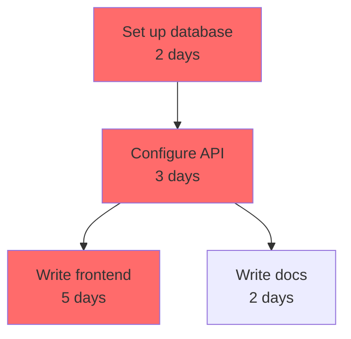

<p align="center">
  
  
  
  
</p>

# Memoriant Temporal Planner Skill

A Claude Code plugin for dependency-ordered long-horizon planning. Describe your tasks and their dependencies — get back a structured DAG, critical path analysis, parallel execution groups, deadline risk flags, and a live-updateable plan with ETA tracking.

**No servers. No Docker. Just install and use.**

## Install

```bash
/install NathanMaine/memoriant-temporal-planner-skill
```

## Cross-Platform Support

### Claude Code (Primary)
```bash
/install NathanMaine/memoriant-temporal-planner-skill
```

### OpenAI Codex CLI
```bash
git clone https://github.com/NathanMaine/memoriant-temporal-planner-skill.git ~/.codex/skills/temporal-planner
codex --enable skills
```

### Gemini CLI
```bash
gemini extensions install https://github.com/NathanMaine/memoriant-temporal-planner-skill.git --consent
```

## Skills

| Skill | Command | What It Does |
|-------|---------|-------------|
| **Temporal Planner** | `/temporal-planner` | Build task DAGs, find critical path, group parallel work, track progress, replan on changes |

## Agent

| Agent | Best Model | Specialty |
|-------|-----------|-----------|
| **Temporal Planner Agent** | Sonnet 4.6 | DAG construction, critical path analysis, execution wave grouping, ETA calculation, replanning |

## Quick Start

```bash
# Plan a project
/temporal-planner

# Or trigger directly
"Plan this project: set up the database (2 days), then configure the API (3 days), then build frontend and write docs in parallel (5 days / 2 days). Launch deadline is April 30."

# Replan after a change
"The database vendor is delayed by 2 weeks. Replan."

# Check progress
"We finished the database setup. Update the plan and give me the new ETA."
```

## What You Get

### Critical Path Analysis
Identifies which tasks determine your minimum project duration. Any slip on the critical path delays the project by the same amount.

### Execution Waves
Groups tasks by dependency level — all tasks in the same wave can run simultaneously:

```
Wave 1 (Day 0):   db-setup [2 days]
Wave 2 (Day 2):   api-config [3 days]
Wave 3 (Day 5):   frontend, docs, tests [parallel — all can start now]
```

### Deadline Risk Flags
Checks every task with a deadline against its earliest possible finish date. Flags any task or chain at risk before it's too late to act.

### Mermaid Diagrams
Generates DAG visualizations in Mermaid syntax (critical path highlighted):



### Live Replanning
When tasks are delayed, blocked, or cancelled, replan from current state with updated critical path and ETA. The skill always asks: "Has the effort estimate changed, or only the start date?" — these have different downstream effects.

## Input Formats

Natural language, structured lists, or YAML — the skill parses all three:

```yaml
tasks:
  - id: db-setup
    name: "Set up database"
    effort_days: 2
    dependencies: []
  - id: api-config
    name: "Configure API"
    effort_days: 3
    dependencies: [db-setup]
    deadline: "2025-04-30"
```

## Source

Built from [NathanMaine/temporal-executive-agent](https://github.com/NathanMaine/temporal-executive-agent) — a research agent for long-horizon planning, replanning, and temporal reasoning.

## License

MIT
