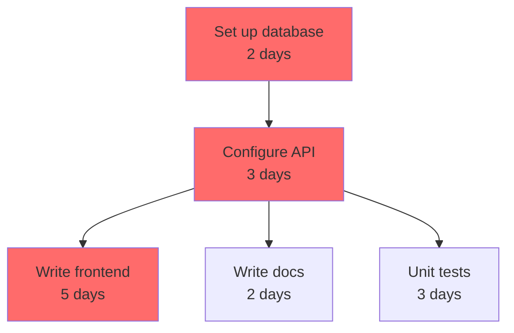

# Temporal Planner Skill

## Purpose

This skill converts a collection of tasks with dependencies, deadlines, and effort estimates into a structured, dependency-ordered execution plan. It constructs a Directed Acyclic Graph (DAG) of tasks, identifies the critical path (the sequence of tasks that determines the minimum possible completion time), surfaces all opportunities for parallel execution, and produces a timestamped plan that can be replanned when circumstances change.

This skill is particularly effective for: software project planning, research roadmaps, compliance initiative timelines, product launch sequences, and any work where tasks have genuine dependencies that constrain execution order.

## When to Use This Skill

Use this skill when the user wants to:
- Turn a backlog or list of tasks into an ordered execution plan
- Understand what tasks are blocking other tasks (critical path)
- Identify which tasks can be done simultaneously to compress the timeline
- Get an estimated completion date given current velocity and dependencies
- Replan after a task is delayed, blocked, or cancelled
- Track progress against a plan and update ETAs dynamically
- Visualize task dependencies as a DAG (in text or Mermaid diagram format)

## Core Concepts

### Directed Acyclic Graph (DAG)

A DAG represents tasks as nodes and dependencies as directed edges. An edge from Task A to Task B means "Task A must complete before Task B can start." The graph must be acyclic — no circular dependencies.

**Detecting cycles:** If the user's task list contains a circular dependency (A depends on B, B depends on C, C depends on A), flag it immediately and ask which dependency is incorrect or should be broken.

### Critical Path

The critical path is the longest sequence of dependent tasks from start to finish. The total duration of the critical path is the minimum possible time to complete the project (assuming unlimited parallel workers).

Any delay to a task on the critical path delays the entire project by the same amount. Tasks NOT on the critical path have "float" — they can slip by their float amount without delaying the project.

**Critical path calculation:**
1. Compute earliest start (ES) and earliest finish (EF) for each task (forward pass)
2. Compute latest start (LS) and latest finish (LF) for each task (backward pass)
3. Float = LS - ES (or LF - EF). Tasks with float = 0 are on the critical path.

### Temporal Constraints

Beyond task dependencies, plans have temporal constraints:
- **Deadline constraints:** A task must complete by a specific date
- **Not-before constraints:** A task cannot start before a specific date (waiting for external input, regulatory window, etc.)
- **Resource constraints:** A specific person or team can only work on one task at a time
- **Calendar constraints:** No work on weekends, holidays, or blackout periods

The skill identifies when temporal constraints conflict with task dependencies and alerts the user.

### Parallel Execution

Tasks that share no dependency path can be executed simultaneously. The skill groups tasks into execution waves:
- **Wave 1:** All tasks with no dependencies (can start immediately)
- **Wave 2:** All tasks whose only dependencies are in Wave 1
- **Wave N:** All tasks whose dependencies are in Waves 1..N-1

Within a wave, all tasks can be parallelized. The plan should identify: "These tasks can all start at the same time" and "You only need to wait for all of them before starting the next wave."

## Input Format

The skill accepts task input in several formats. Claude will parse and normalize to the internal format.

### Natural Language

"We need to: set up the database, then configure the API (depends on database), then write the frontend (depends on API), and also write documentation (depends on API). Also write unit tests — they depend on the API but can happen in parallel with the frontend."

### Structured List

```
- Task: Set up database
  Effort: 2 days
  Dependencies: none

- Task: Configure API
  Effort: 3 days
  Dependencies: [Set up database]

- Task: Write frontend
  Effort: 5 days
  Dependencies: [Configure API]

- Task: Write documentation
  Effort: 2 days
  Dependencies: [Configure API]

- Task: Unit tests
  Effort: 3 days
  Dependencies: [Configure API]
  Deadline: 2025-04-15
```

### JSON/YAML

```yaml
tasks:
  - id: db-setup
    name: "Set up database"
    effort_days: 2
    dependencies: []
  - id: api-config
    name: "Configure API"
    effort_days: 3
    dependencies: [db-setup]
  - id: frontend
    name: "Write frontend"
    effort_days: 5
    dependencies: [api-config]
  - id: docs
    name: "Write documentation"
    effort_days: 2
    dependencies: [api-config]
  - id: tests
    name: "Unit tests"
    effort_days: 3
    dependencies: [api-config]
    deadline: "2025-04-15"
```

## Methodology

### Step 1: Parse and Validate

1. Extract all tasks from user input
2. Normalize to: `{id, name, effort_days, dependencies: [], deadline: null, not_before: null, assignee: null, status: "pending"}`
3. Validate: no duplicate IDs, all referenced dependencies exist, no cycles
4. If cycles detected: report the cycle and ask which dependency to break

### Step 2: Build the DAG

Construct the dependency graph. For each task, identify:
- **Predecessors:** Tasks that must complete before this one
- **Successors:** Tasks that this one unblocks

### Step 3: Execute Forward Pass (Earliest Times)

Starting from tasks with no dependencies (start = Day 0):
- Earliest Start (ES) = max(EF of all predecessors). If no predecessors: ES = 0
- Earliest Finish (EF) = ES + effort_days

Work through all tasks in topological order.

### Step 4: Execute Backward Pass (Latest Times)

Starting from tasks with no successors (project end):
- Latest Finish (LF) = project EF (unless a deadline is earlier)
- Latest Start (LS) = LF - effort_days

Work backwards through all tasks in reverse topological order.

### Step 5: Compute Float and Critical Path

- Float = LS - ES (= LF - EF)
- Critical path: all tasks where Float = 0
- Total project duration = max(EF of all tasks with no successors)

### Step 6: Identify Execution Waves

Group tasks into parallel execution waves using topological level assignment:
- Level 0: no dependencies
- Level N: all dependencies are at level < N

Report each wave as a group of tasks that can all start simultaneously.

### Step 7: Check Temporal Constraints

- For each task with a deadline: verify EF <= deadline. If not, flag as a **deadline risk**.
- For each task with a not-before constraint: adjust ES = max(ES, not_before). Recompute downstream tasks.
- If any temporal constraint forces a task onto the critical path, flag it.

### Step 8: Generate the Plan

Produce:
1. **DAG summary:** Total tasks, critical path tasks, project duration, estimated completion date
2. **Execution waves:** Grouped parallel tasks per wave
3. **Critical path narrative:** Sequence of critical path tasks and why
4. **Deadline risks:** Any tasks or their dependents at risk of missing a deadline
5. **Mermaid diagram** (optional): Text-based DAG visualization

## Output Format

### Plan Summary

```
PROJECT PLAN SUMMARY
====================
Total tasks: 5
Project duration: 10 days
Estimated completion: 2025-04-14 (starting 2025-04-02)
Critical path: db-setup → api-config → frontend (10 days)
Tasks with float: docs (2 days float), tests (2 days float)
Deadline risks: None

EXECUTION WAVES
===============
Wave 1 (Day 0): db-setup [2 days]
Wave 2 (Day 2): api-config [3 days]
Wave 3 (Day 5): frontend, docs, tests [can all start in parallel]
  - frontend: 5 days → done Day 10 [CRITICAL]
  - docs: 2 days → done Day 7 (2 days float)
  - tests: 3 days → done Day 8 (2 days float)

CRITICAL PATH
=============
db-setup (2d) → api-config (3d) → frontend (5d) = 10 days total
Any delay on this path delays the project.
```

### Mermaid Diagram



(Red = critical path tasks)

## Replanning

When the user reports a change (a task is delayed, blocked, or cancelled), replan from the current state:

1. Update the affected task's status and/or effort estimate
2. Recompute ES/EF/LS/LF for all downstream tasks
3. Recompute the critical path (it may have shifted)
4. Report: new project duration, what changed on the critical path, any new deadline risks
5. Suggest options: which tasks could be parallelized more aggressively, which could be cut in scope, which dependencies could be challenged

**Replanning prompt:** When a delay is reported, always ask: "Has the effort estimate for [task] changed, or only the start date?" These have different downstream effects.

## Progress Tracking and ETA

When the user reports completed tasks, update the plan:

1. Mark tasks as complete with their actual completion date
2. If actual duration differed from estimated, note the delta (useful for velocity calibration)
3. Recompute remaining project duration from the current state
4. Update ETA based on: remaining critical path duration + current date
5. If the project is tracking behind, identify which critical path tasks are at risk

### ETA Calculation

```
ETA = current_date + remaining_critical_path_effort_days
```

If multiple people are working in parallel, adjust by available parallel worker capacity:
```
ETA = current_date + (remaining_critical_path_effort_days / parallelism_factor)
```

where `parallelism_factor` is the number of workers available for critical path tasks.

## Step-by-Step Procedure

1. **Collect tasks.** Ask the user for their full task list with dependencies and effort estimates. If estimates are missing, ask or use defaults (note them as assumptions).

2. **Validate the DAG.** Check for cycles, missing dependencies, duplicate IDs.

3. **Run forward and backward passes.** Compute ES, EF, LS, LF, Float for all tasks.

4. **Identify critical path.** Report which tasks are on the critical path.

5. **Group into execution waves.** Show which tasks can run in parallel.

6. **Check temporal constraints.** Flag deadline risks and not-before constraint effects.

7. **Generate the plan.** Output the summary, wave groups, critical path narrative, and optionally a Mermaid diagram.

8. **Offer to replan.** After presenting the plan, offer to replan if the user changes any constraints or task statuses.

## Examples

### Example 1: Software project with a hard deadline

**User:** "We have to launch in 6 weeks. Here are our tasks: [list of 12 tasks with dependencies]."

**Claude should:**
1. Build the DAG, compute critical path and project duration
2. If project duration > 6 weeks: immediately flag the deadline conflict and identify which tasks could be cut or parallelized to compress the timeline
3. Show execution waves and which tasks have float
4. Suggest: "These 3 tasks are on the critical path. If you can add another developer to [specific task], you can compress it by N days."

### Example 2: Replanning after a blocker

**User:** "The database vendor is delayed. The 'Set up database' task is now 2 weeks out instead of starting immediately."

**Claude should:**
1. Shift db-setup start to not-before = today + 14 days
2. Recompute all downstream tasks
3. Show new project completion date
4. Show what's on the critical path now (the vendor delay IS the critical path)
5. Suggest: "While waiting, these tasks have no dependency on the database and can proceed now: [list]"

### Example 3: Research roadmap

**User:** "I'm planning a 3-month research project. Here are the components: literature review (2 weeks), data collection (3 weeks, depends on lit review), data cleaning (1 week, depends on collection), modeling (4 weeks, depends on cleaning), writing (3 weeks, depends on modeling), peer review (2 weeks, depends on writing)."

**Claude should:**
1. Build a fully sequential critical path (no parallelism in this case)
2. Total: 2+3+1+4+3+2 = 15 weeks — flag this exceeds 3 months (13 weeks)
3. Suggest: Can lit review and data collection prep overlap? Can writing start before modeling is 100% complete?
4. Show compressed plan if overlaps are possible

## Error Handling

| Situation | Response |
|-----------|----------|
| Circular dependency detected | Name the cycle, ask which edge to remove |
| Effort estimates missing | Ask for estimates. If user can't provide, note defaults (e.g., 1 day) as assumptions |
| Project duration exceeds stated deadline | Flag immediately, quantify the gap, suggest options to compress |
| Task referenced in dependency not found | Flag the unknown dependency, ask if it's a new task or a typo |
| User provides 50+ tasks | Process in full, but offer a "top 10 critical path tasks" summary first |
| No dependencies specified | Ask: "Are these tasks truly independent, or did you omit the dependencies?" |

## Version History

- 1.0.0 — Initial release. DAG construction, critical path analysis, execution wave grouping, temporal constraint resolution, progress tracking, replanning, ETA estimation, Mermaid diagram output.
